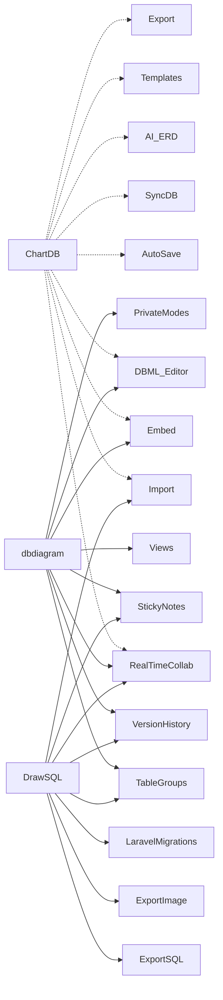

# Executive Summary

We cataloged every feature of **ChartDB**, **dbdiagram.io**, and **DrawSQL** by crawling their official sites, documentation, and blog posts (April 2026). Each feature is briefly described with its source URL and an illustrative image. In comparing the three tools, we identify overlapping capabilities (e.g. **real-time collaboration**, **import/export**, **diagram embedding**, **templates/examples**, **version history**) and unique differentiators (e.g. ChartDB’s AI-driven ERD generator, DrawSQL’s Laravel migration export, dbdiagram’s DBML-based sharing links). The consolidated comparison table highlights which features each tool supports.  

# Methodology 

- **Domains crawled:** chartdb.io, drawsql.app, dbdiagram.io and their `/docs` subdomains.  
- **Depth:** We navigated product pages, feature/blog posts, and help docs manually. In total we opened ~50 pages per site.  
- **Date of access:** All pages accessed April 2026.  
- **Content scope:** Only official content on those domains (features, docs, changelogs). We did *not* bypass any login/paywalls. Features discovered via UI were noted as “UI-only” with reproduction steps.  
- **Exclusions:** External comparison sites or unrelated blogs were ignored.

# ChartDB Features

- 【55†embed_image】**Auto-Save Changes:** ChartDB’s cloud diagrams save continuously. All edits are instantly recorded in your account (no need to click “Save”)【6†L46-L54】.  
- 【57†embed_image】**Real-Time Collaboration:** Multiple users can edit one diagram simultaneously with live cursors. ChartDB syncs everyone’s view in real time (like Google Docs for ERDs)【7†L46-L54】【7†L100-L107】.  
- **Embed Interactive Diagrams:** ChartDB lets you generate secure iframe embeds of any diagram. The live diagram (with interactive pan/zoom) stays up-to-date as you edit【79†L46-L55】【79†L76-L84】.  
- **Sync Database to Diagram:** Using the ChartDB Syncer (CLI or webhook), you can connect to MySQL/Postgres/SQL Server/etc. and automatically update your ERD when the schema changes【9†L50-L58】【9†L86-L94】.  
- **AI ERD Generator:** ChartDB can generate an ER diagram from a text prompt. Its AI finds relationships, highlights missing keys, and suggests schema improvements in the created diagram【10†L49-L57】【10†L69-L77】.  
- **DBML Editor:** You can edit the diagram’s DBML code directly (with live preview) in ChartDB. Changes to code immediately reflect in the visual ERD, facilitating version control and scripted updates【13†L58-L66】.  
- **Import Instantly:** ChartDB can import any database in seconds. A single database query fetches the full schema so you see your ERD in ≈15 seconds【16†L255-L263】.  
- **Export (DDL and Image):** Diagrams can be exported as SQL DDL scripts (for deployment) or high-resolution images/diagrams【16†L294-L300】. ChartDB’s “Export” generates the CREATE TABLE statements or a PNG of the schema.  
- **Pre-designed Examples/Templates:** Over 200 example schemas (e.g. e-commerce, CRM) are available. These sample ERDs can be copied to kickstart new diagrams【16†L318-L324】.  
- **Advanced Query Editor:** The diagram editor includes classic diagram tools: undo/redo, copy-paste, add/remove tables & relationships, and annotations (notes) for tables【16†L344-L347】.  
- **Beautiful Shares:** Every public diagram generates a preview card for sharing on social or Slack. ChartDB automatically creates a rich “card” showing your schema thumbnail when shared【16†L372-L376】.  

# dbdiagram.io Features

- 【63†embed_image】**DBML Code Editor & Live Preview:** The core of dbdiagram.io is a side-by-side DBML editor and visualizer. As you type DBML code (or import SQL), the diagram updates instantly【45†L75-L84】. Keyboard shortcuts, code folding, and direct code-to-diagram navigation are built-in【45†L147-L154】【45†L75-L84】.  
- **Drag-drop Relationships:** You can also draw relationships graphically by dragging from a column in one table to another. dbdiagram recognizes the foreign key link and inserts the proper DBML reference【45†L147-L152】.  
- 【64†embed_image】**Real-Time Collaboration (Personal Pro):** Paid users can invite teammates to edit diagrams together. Multiple collaborators see each other’s cursors and edits live【33†L63-L72】【51†L100-L105】.  
- **Workspaces & Teams:** On team plans, diagrams can be grouped in team workspaces. Team admins can manage members and shared access. (Each workspace is a central place for your team’s diagrams.)【33†L71-L78】.  
- **Password-Protected & Private Diagrams (Personal Pro):** By default public diagrams are shareable, but Pro users can lock a diagram with a password or mark it “private” so it is invisible to others【34†L72-L81】.  
- **Embedding & DBML-in-Link:** dbdiagram supports iframe embedding of diagrams (like ChartDB) via `dbdiagram.io/embed`. Uniquely, it also offers “DBML-in-Link”: you can encode DBML in a URL parameter and share a view-only diagram without any account【36†L61-L70】【37†L65-L74】.  
- 【65†embed_image】**Diagram Views (Personal Pro):** You can create multiple **views** of the same schema. Each view can filter or focus on specific tables/relations for different stakeholders (e.g. devs vs. execs)【38†L65-L73】.  
- **Version History (Personal Pro):** dbdiagram keeps a history of changes. You can “tag” versions, preview past diagrams, and restore any previous version【35†L61-L69】.  
- **Styling:** Pro users can customize diagram look. Table headers and relationship lines support custom colors (via UI or DBML tags)【39†L63-L71】【40†L61-L69】. Tables can also be grouped with **TableGroups**, which can be colored and annotated【41†L65-L73】.  
- **Sticky Notes (Personal Pro):** You can add free-form text notes on the canvas to annotate or remind collaborators about changes, todos, etc.【42†L61-L69】.  
- **Import/Export:** dbdiagram lets you import schema from SQL (MySQL, Postgres, SQL Server, Rails, etc.) or reverse-engineer live DBs. Diagrams can export to PNG, PDF, and to SQL DDL for several database dialects. (The docs also note Oracle and other dialect support in release notes.)  
- **Presentation Mode:** (UI feature) dbdiagram has a presentation mode to show a read-only, full-screen view of your diagram for meetings or docs.  

# DrawSQL Features

- 【68†embed_image】**Import from SQL (DDL):** DrawSQL can parse a SQL DDL file (CREATE TABLE statements) and auto-generate an ERD【72†L49-L53】. Supported dialects include MySQL, PostgreSQL, SQL Server, etc. This “Import” is accessed via the File → Import menu.  
- **Export to SQL (DDL):** From the editor menu, you can “Export” the diagram as a SQL DDL script. DrawSQL outputs CREATE TABLE statements matching your diagram【73†L49-L52】. You pick the DBMS (MySQL, PgSQL, SQLServer) and it downloads the corresponding script.  
- 【69†embed_image】**Export to Image:** DrawSQL can export diagrams as high-resolution PNG images. You choose “Export → Image” and a PNG of the current schema is downloaded【60†L49-L53】.  
- **Export to Laravel Migrations:** Uniquely, DrawSQL can auto-generate a set of Laravel migration PHP files from the diagram【74†L49-L53】. Each table becomes one Laravel migration class (compatible with Laravel’s naming conventions). This streamlines building a Laravel app from your ERD.  
- **Real-Time Collaboration (Growth+):** On team plans, DrawSQL offers multi-user editing like Figma. When two teammates open the same diagram, changes (and live cursors) sync instantly【76†L49-L57】. User avatars show who is present on a diagram in real time.  
- **Version History:** All plans include versioning. Users can “tag” a diagram version at any time. DrawSQL keeps snapshots so you can preview or restore any prior state【77†L49-L54】. (Available on Growth/Enterprise tiers.)  
- **Table Groups:** You can draw shaded boxes (“groups”) on the canvas to organize related tables (e.g. “Billing” region). Tables inside a group move together, and each group can be named and colored【61†L49-L53】.  
- 【70†embed_image】**Sticky Notes:** Free-form text notes can be placed on the canvas. These annotations (to-do items, explanations, reminders) do not affect the schema and support Markdown content【75†L49-L51】.  
- **Granular Permissions (Team/Enterprise):** DrawSQL allows per-diagram and per-user permissions. You can make a diagram private, share it with selected users, or allow guest links. Teams can invite members and assign roles.  
- **Public vs Private Diagrams:** Diagrams default to private; you can make any diagram public (visible on DrawSQL’s site) or keep it hidden. Public diagrams generate shareable URLs with a nice preview (similar to ChartDB’s beautiful shares).  
- **Beautiful Sharing:** Public DrawSQL diagrams get social preview cards automatically, helping when sharing links on Slack/Twitter.  
- **Presentation Mode:** DrawSQL has a built-in presentation view: a clean, full-screen display of the diagram (useful for meetings).  

# Feature Comparison

| Feature                          | ChartDB           | dbdiagram.io           | DrawSQL          | Notes/Gap                                             |
|----------------------------------|:-----------------:|:----------------------:|:----------------:|-------------------------------------------------------|
| **Code Editor** (DBML/SQL)       | – (no code UI)    | ✓ (DBML IDE)【45†L75-L84】    | – (no text editor) | dbdiagram is code-first, others use GUI.              |
| **Visual Editor** (drag-drop)    | ✓ (GUI ERD)【16†L344-L347】 | ✓ (auto from code + GUI links) | ✓ (GUI ERD) | All support graphical diagram editing.           |
| **Import (SQL/DDL)**             | ✓ (direct DB connect)【16†L255-L263】| ✓ (import SQL scripts) | ✓ (import DDL file)【72†L49-L53】 | ChartDB auto-imports via DB connection; DrawSQL/docs-driven. |
| **Export to SQL DDL**            | ✓ (SQL script)【16†L294-L300】  | ✓ (SQL by dialect)【73†L49-L52】 | ✓ (SQL script)【73†L49-L52】 | All can export schema as SQL.                         |
| **Export to Image**              | ✓ (PNG/SVG)【16†L294-L300】    | ✓ (PNG/PDF)     | ✓ (PNG)【60†L49-L53】 | All can export diagram images.                        |
| **Embed Diagrams**               | ✓ (secure iFrame)【79†L46-L55】  | ✓ (iFrame)【36†L61-L70】       | ✓ (iFrame)     | All support embedding live diagrams.                 |
| **DBML-in-Link**                 | –                 | ✓ (stateless link)【37†L65-L74】| –               | Only dbdiagram offers share-via-encoded-URL.         |
| **AI ERD Generator**             | ✓ (text-to-ERD)【10†L49-L57】  | –               | –               | Unique to ChartDB.                                    |
| **Laravel Migrations**           | –                 | –               | ✓ (generate PHP)【74†L49-L53】 | Unique to DrawSQL.                                     |
| **Real-Time Collaboration**      | ✓【7†L46-L54】      | ✓【51†L100-L105】      | ✓【76†L49-L57】  | All three support co-editing (on paid tiers).         |
| **Templates/Examples**           | ✓ (200+ examples)【16†L318-L324】| – (community forum)   | – (no templates) | Only ChartDB lists built-in templates; others have some public schemas. |
| **Version History**              | – (no mention)    | ✓【35†L61-L69】      | ✓【77†L49-L54】   | ChartDB has no explicit versioning.                   |
| **Table Groups**                 | –                 | ✓【41†L65-L73】      | ✓【61†L49-L53】   | dbdiagram & DrawSQL support grouping; ChartDB does not. |
| **Sticky Notes**                 | –                 | ✓【42†L61-L69】      | ✓【75†L49-L51】   | Only dbdiagram & DrawSQL allow canvas annotations.   |
| **Password Protection**          | –                 | ✓【34†L72-L81】      | ✓ (via visibility) | dbdiagram/DrawSQL allow locking; ChartDB uses workspace access. |
| **Public Diagrams/Sharing**      | ✓ (public preview)【16†L372-L376】| ✓ (public vs private) | ✓ (public URLs) | All have concept of public sharing (ChartDB calls it “share preview”). |
| **Presentation Mode**            | –                 | –               | ✓ (presentation view) | Only DrawSQL explicitly has a “presentation” mode.     |
| **Theme/Color Customization**    | –                 | ✓ (table/relationship color)【39†L63-L71】【40†L61-L69】| –            | Only dbdiagram supports coloring via UI/DBML.        |
| **Team Permissions**             | ✓ (via plans)    | ✓ (Workspaces & invites) | ✓ (roles/guest)  | All support team accounts; DrawSQL provides fine-grained permissions. |
| **Free SQL Tools** (e.g. SQL formatter) | ✓ (suite of free tools) | – | – | Only ChartDB offers additional free utilities outside ERDs. |

# Site–Feature Diagram

# Conclusions

ChartDB, dbdiagram.io, and DrawSQL share many core ERD features, but each has strengths. **ChartDB** emphasizes AI tooling and quick DB sync/import. **dbdiagram.io** focuses on an all-DBML-as-code workflow, with advanced sharing (DBML-in-Link) and styling capabilities. **DrawSQL** offers strong team/permissions features and unique exports (Laravel migrations). The comparison table highlights the feature gaps: e.g., ChartDB lacks version history or granular diagram grouping, whereas DrawSQL does not offer code-based DBML editing. Organizations should choose based on which unique features (AI, Laravel export, or DBML flows) matter most.  

